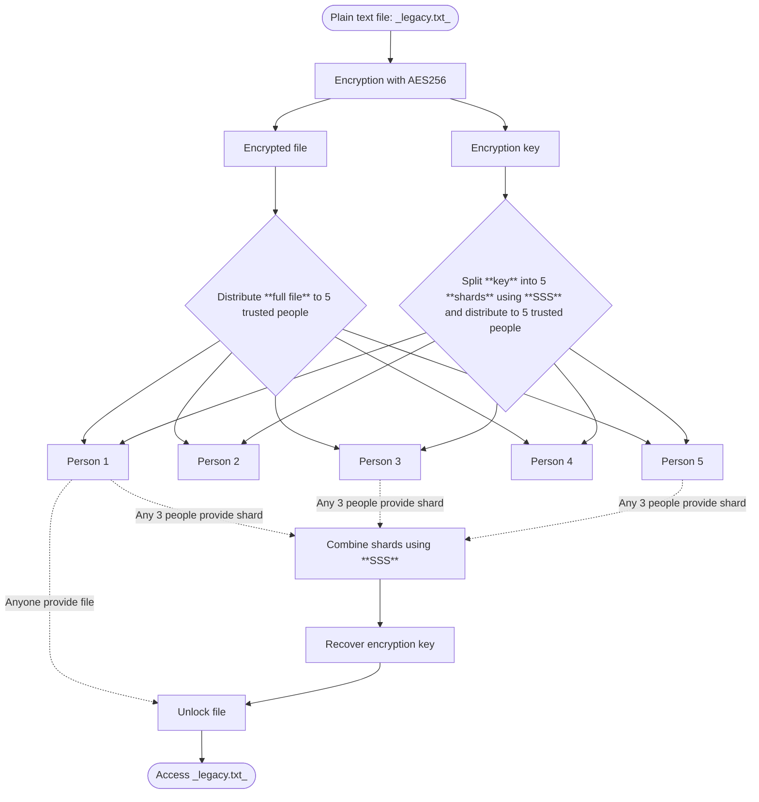

## _Bruta Fin_ Protocol

A simple protocol to access your **digital legacy** if _(hopefully not!)_ needed, like a [dead man's switch](https://en.wikipedia.org/wiki/Dead_man's_switch).

> _"Bruta fin"_ is Milanese dialect for _death_, literally meaning _"bad ending"_ (_"brutta fine"_).

### Why?

1. Proof of concept
2. Peace of mind (_"Better safe than sorry"_ - _"Meglio prevenire che curare"_)

### Architecture



### Requirements

- `gpg` ([apt](https://packages.ubuntu.com/questing/gnupg2), [dnf](https://packages.fedoraproject.org/pkgs/gnupg2/gnupg2/))
- `ssss` ([apt](https://packages.ubuntu.com/questing/ssss), [dnf](https://packages.fedoraproject.org/pkgs/ssss/ssss/))

### Usage: Setup

> [!TIP]
> Store in `legacy.txt` any information you'd like to pass on: password vaults, 2FA codes, device passwords, etc.

1. Encrypt the legacy file with AES256:

   ```bash
   gpg --symmetric --cipher-algo AES256 --output legacy.gpg legacy.txt
   ```

2. Split the passphrase into 5 shards using [Shamir's Secret Sharing](https://en.wikipedia.org/wiki/Shamir's_secret_sharing), requiring any 3 to reconstruct:

   ```bash
   ssss-split -t 3 -n 5
   ```

3. Distribute the encrypted file and shards to 5 trusted people (include the shard index).

### Usage: Recovery

> [!CAUTION]
> This should ideally _never_ happen, but make sure it works, _test_ it!

1. Reconstruct the key from 3 shards (include the shard index):

   ```bash
   ssss-combine -t 3
   ```

2. Decrypt the file:

   ```bash
   gpg --decrypt --output legacy.txt legacy.gpg
   ```
